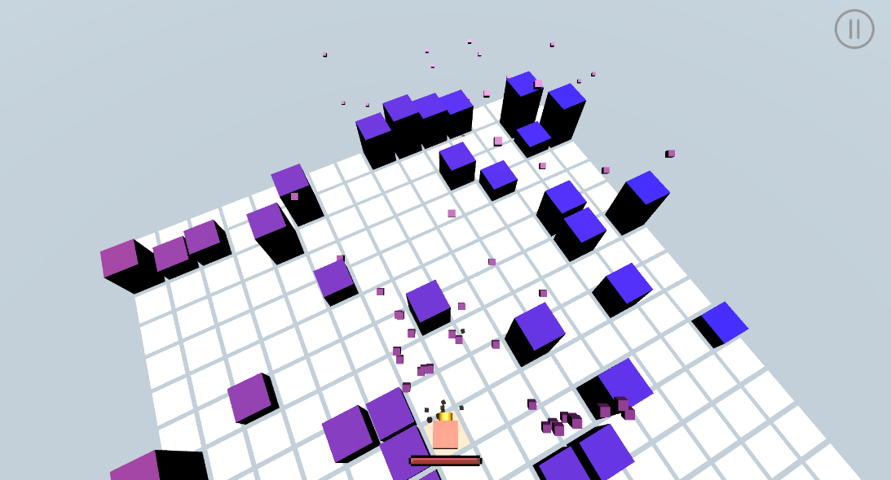

RandomMap_TPS（单人版本）

制作时间：2021.4

实现功能：随机地图生成、Player武器切换（按tab键）、敌人AI寻路等

实现逻辑：

学到的内容：继承、接口、事件、单例模式、协程的应用；lerp的灵活使用、使用一些unity特性例如[ContextMenu()]来方便调试，积攒了解决各种bug的经验。

待改进：对象池优化子弹生成、使用Photon制作联网多人版本

游戏界面:

